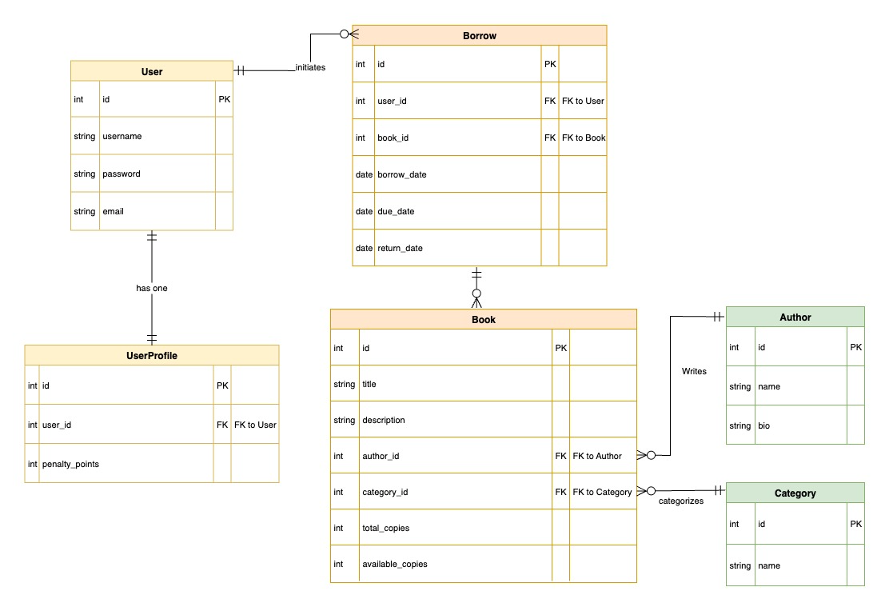

# Django Library Management API

A RESTful API for managing books, users, and borrowing system using Django REST Framework.

## Features

- JWT Authentication (Register/Login/Refresh)
- Admin-only book/category/author management
- Users can browse books and borrow up to 3 at a time
- Penalty points added for late returns
- Atomic inventory updates
- Class-based views and model serializers
- Filtering books by author/category

## ER Diagram

The following diagram represents the database schema:

## Tech Stack

- **Backend:** Django REST Framework
- **Auth:** Simple JWT
- **Database:** SQLite (default)
- **Tools:** Postman, Git, GitHub

## Setup Instructions

1. Clone the repository  
2. Create a virtual environment and activate it  
3. Install dependencies: `pip install -r requirements.txt`  
4. Run migrations: `python manage.py migrate`  
5. Create superuser: `python manage.py createsuperuser`  
6. Run the server: `python manage.py runserver`

## API Endpoints
 
- `POST /api/register/` — Register a user
- `POST /api/login/` — JWT login
- `POST /api/token/refresh/` — Refresh JWT token
- `GET /api/authors/` — List authors
- `POST /api/authors/` — Create author (Admin only)
- `GET /api/categories/` — List categories
- `POST /api/categories/` — Create category (Admin only)
- `GET /api/books/` — List books (supports filters: `?author=<id>&category=<id>`)
- `POST /api/books/` — Create book (Admin only)
- `GET /api/books/<id>/` — Retrieve single book
- `PUT /api/books/<id>/` — Update book (Admin only)
- `DELETE /api/books/<id>/` — Delete book (Admin only)
- `POST /api/borrow/` — Borrow a book (max 3 active borrows)
- `GET /api/borrow/active/` — List user’s active borrows
- `POST /api/return/` — Return a book
- `GET /api/users/<id>/penalties/` — Get user penalties (self or admin)

## Borrowing & Penalty Rules

1. Borrow Limit: 3 active books at a time
2. Due Date: 14 days from borrow date
3. Penalty: 1 point per late day
4. Availability: Borrowing decreases available_copies, returning increases it

## Author

Md Fahad Mir

